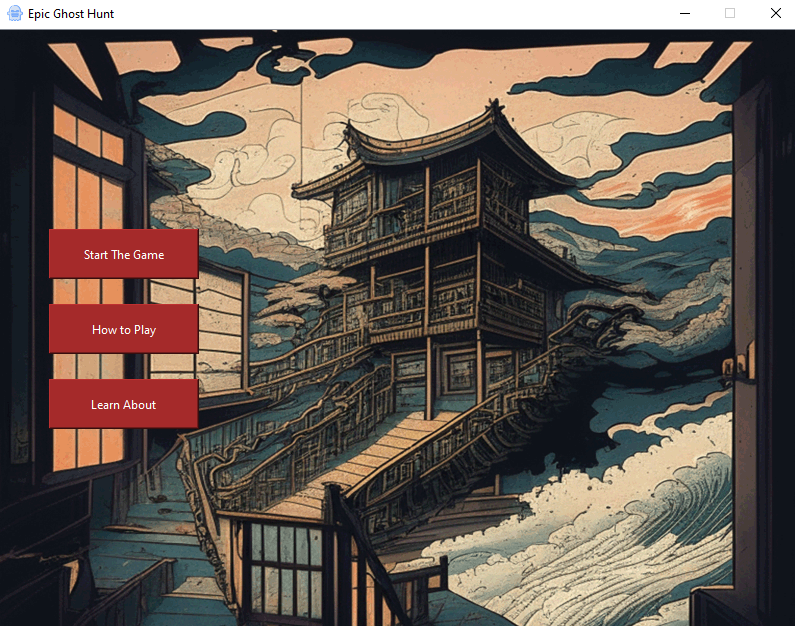
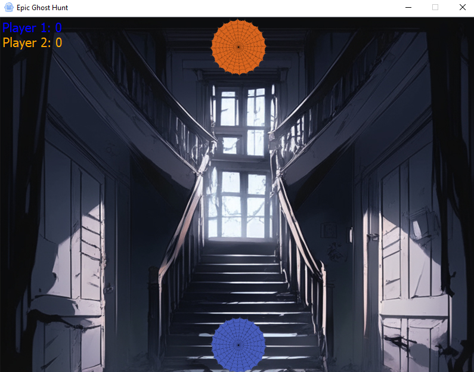
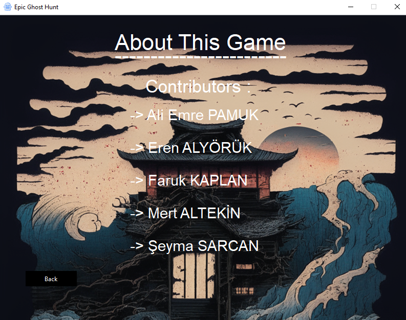
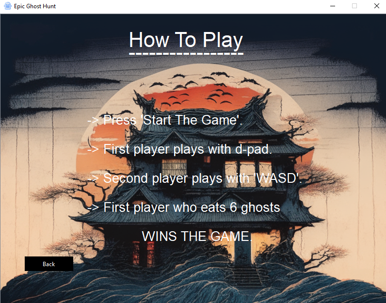

# Epic Ghost Hunt

## Group 21

The implementation of this hide-and-seek game using C++ with a GUI provides an
engaging and entertaining gaming experience. By incorporating limited player vision, random
ghost movements, and a scoring system, the game promotes strategic thinking and
decision-making. The graphical user interface enhances the overall gameplay, making it
visually appealing and intuitive for players. The development of this hide-and-seek game
serves as an excellent demonstration of C++ programming skills, GUI implementation, and
game design principles.

### Note

- We finished most of the project before the announcement about using Github.
- We used QT for the GUI design.

### Images

| Main Menu | In Game | About | How to Play |
|-----------|--------|-------|-------------|
|||||

### Contributors

- Ali Emre Pamuk - 21050111021
- Eren Alyörük - 21050111077
- Faruk Kaplan - 21050111026
- Mert Altekin - 21050111065
- Şeyma Sarcan - 19050111041
